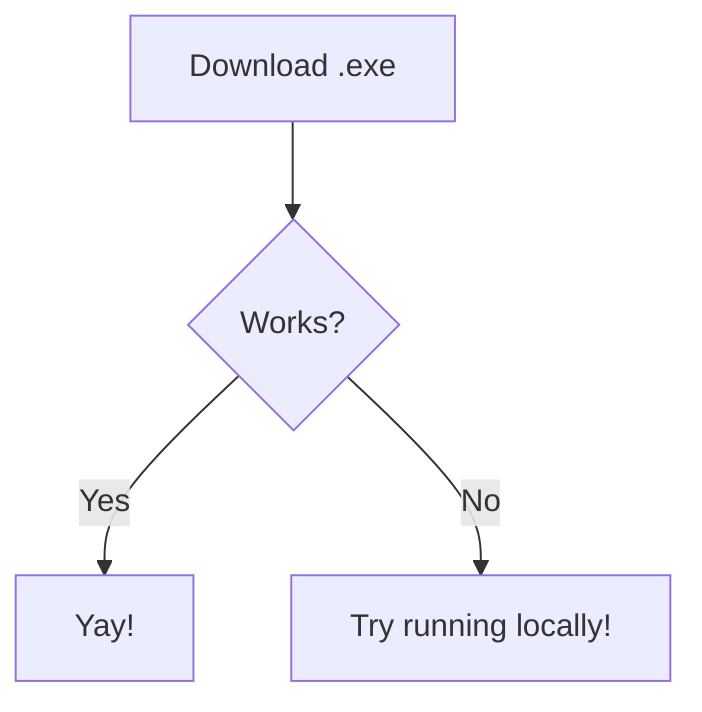

# Findo File Finder

[](https://opensource.org/licenses/) 

Findo is a blazingly fast, lightweight file search tool built from the ground up in Rust and powered by egui. Designed for speed, minimal resource usage, and immediate zero-setup search, Findo gives you total control over your local filesystem without the baggage of background services.


## Why Findo in the first place?

- Zero background indexing & memory bloat
- No setup required (just an .exe)
- Blistering fast cross-platform speed
- Portable & Privacy-First

| Feature / Metric | Findo (Rust) | Windows Explorer Search |
| :--- | :--- | :--- |
| **Average Search Time (214 GB)** | **~20 seconds** | **2+ minutes** (120+ seconds) |
| **Search Mechanism** | Multi-threaded parallel live scan (`jwalk` / `std::fs`) | Sequential single-threaded directory traversal + unindexed query fallback |
| **UI Responsiveness** | **100% Smooth** (Runs scan off the main thread in background) | Frequently freezes, hangs, or shows a slow green loading bar |
| **Indexing Requirement** | **None** (On-demand in-memory search) | Requires background Windows Search service to be fast (slow without index) |
| **Resource Usage** | Lightweight CPU burst during scan; **0% RAM/CPU** when idle | Heavy continuous disk I/O and Windows Search service overhead |
| **Cross-Platform** | Windows, Linux, macOS | Windows only |

## Tech Stack

```
  Findo
    ├── 🦀 Rust
    │   └── Main Language, Backend
    │
    └── 🖼️ egui/eframe (Also Rust!)
        └── GUI Framework, Frontend
```


## Installation

- Download the .exe file on [GitHub](https://github.com/minecraftmelonman/Findo/releases)
- Open the .exe (if an anti-virus message pops up, click open anyways)
-   (If you are on Linux, try using [Wine](https://www.winehq.org/) or Run Locally)
- Findo is installed! Enjoy!
    
## Run Locally

Clone the project from Github

```bash
  git clone https://github.com/minecraftmelonman/Findo
```

Build the Rust project using Cargo

```bash
  cargo build --release
```

Look for the outputed file in ***Target -> Release***

Open your newly created file, and you're done!


## Installation flowchart


## Contributing

Contributions are always welcome!

You can submit a pull request at any time.

